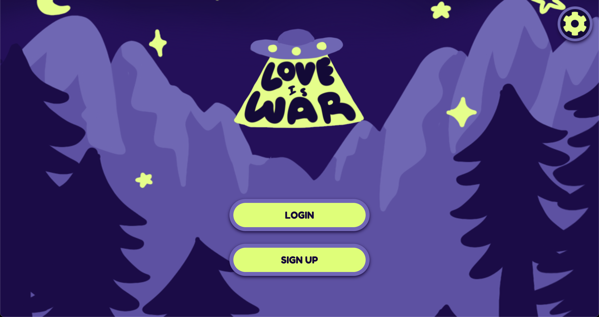
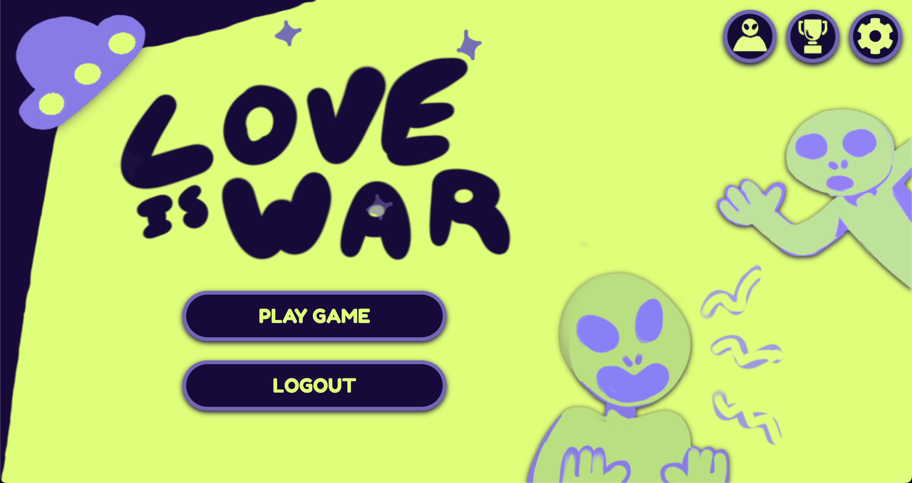
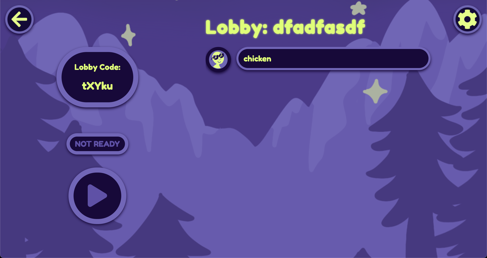
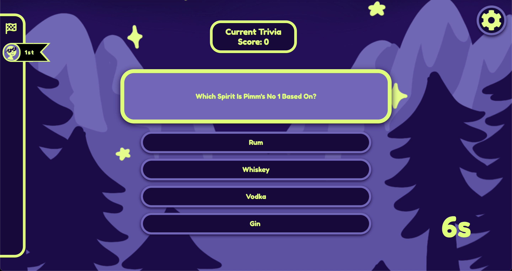
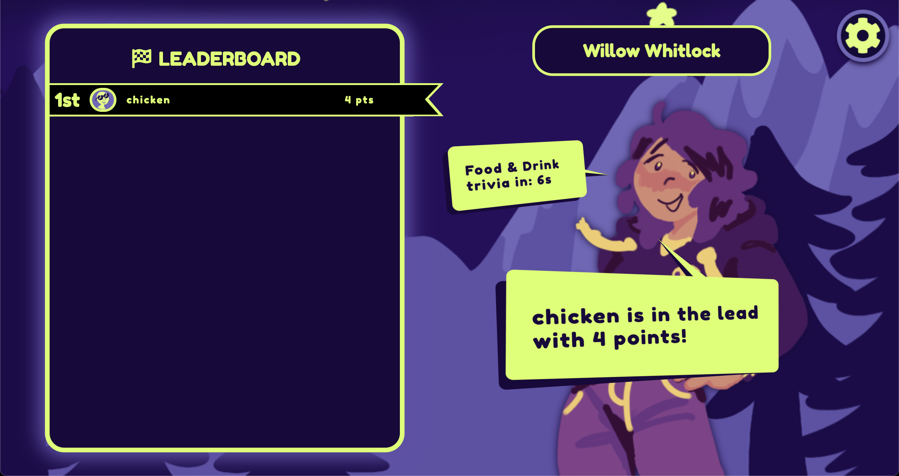
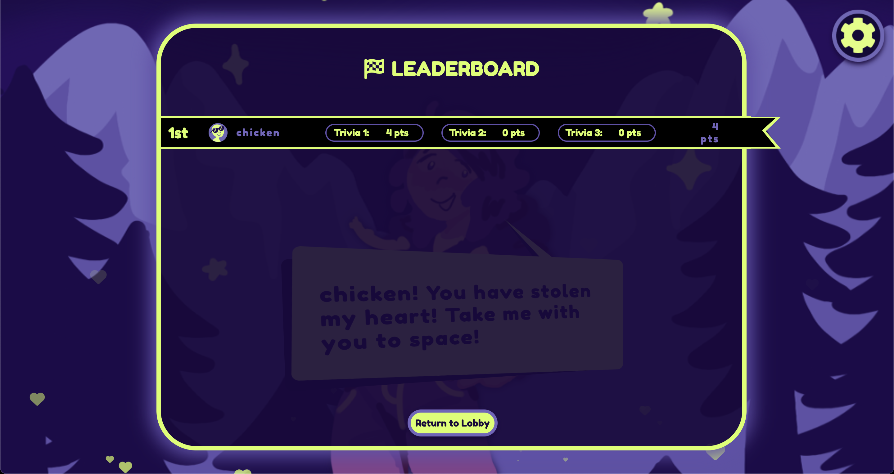
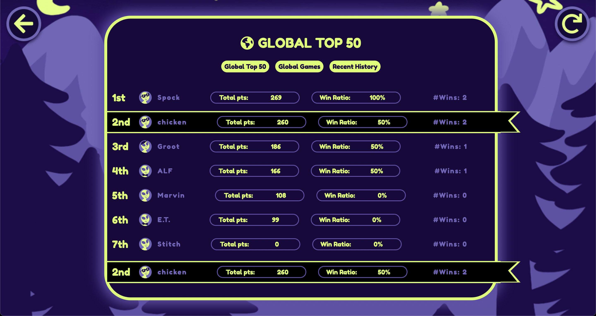
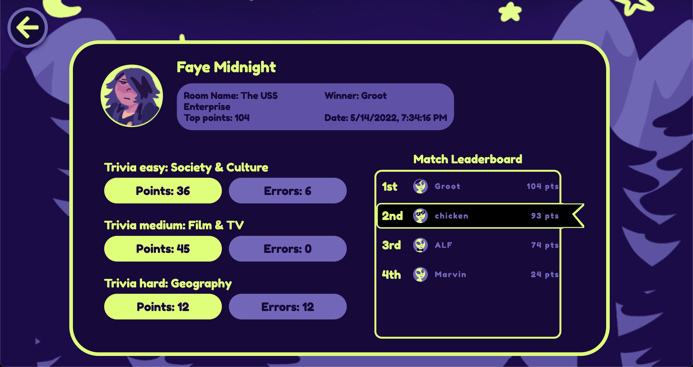
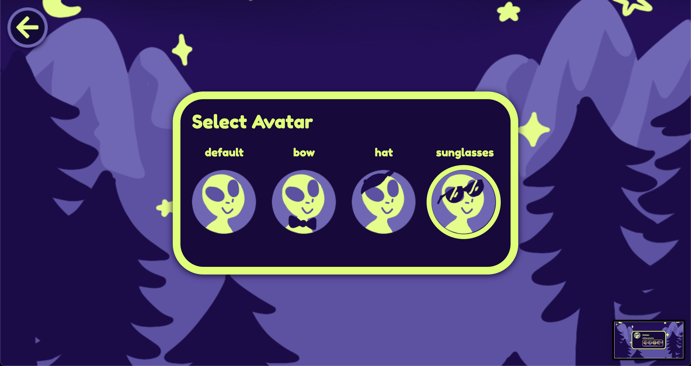
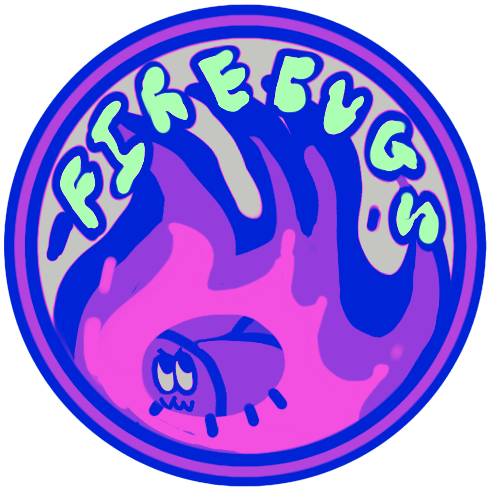

# Love is War 

A multiplayer party game featuring a group of Aliens fighting for the love of a Human! Load up the lobby and compete against other players in quick rounds of Trivia. When it comes to dating... Love is War!

<!-- 
<strong><a href="https://love-is-war-production.up.railway.app/" target="_blank">Play now!</a></strong>
 -->

## Gameplay Screenshots 

## Built with 

## Meet our team 

We are a team of students composed of a designer and full-stack web developers. This project was build to showcase our experience, skills, and our love for gaming.

- [Callista Stefanie Taswin](https://github.com/CalliStef) - Full Stack Developer
- [Laurent Beique](https://github.com/lbeique) - Full Stack Developer
- Seth Mogk - Designer

